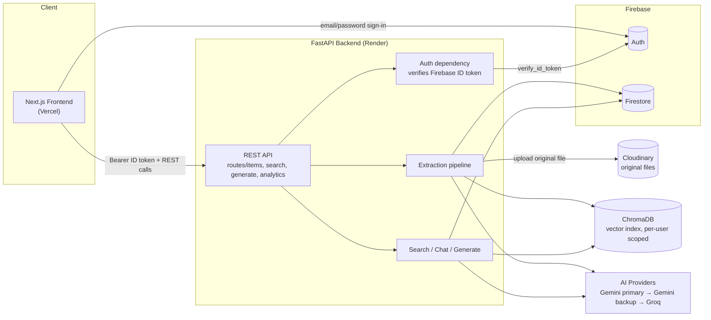
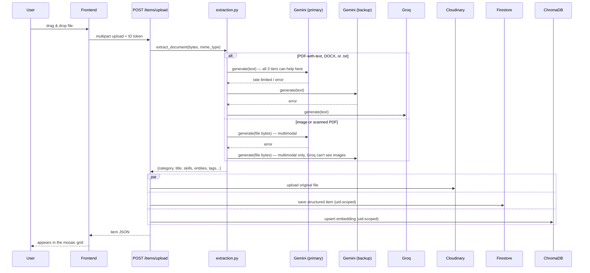
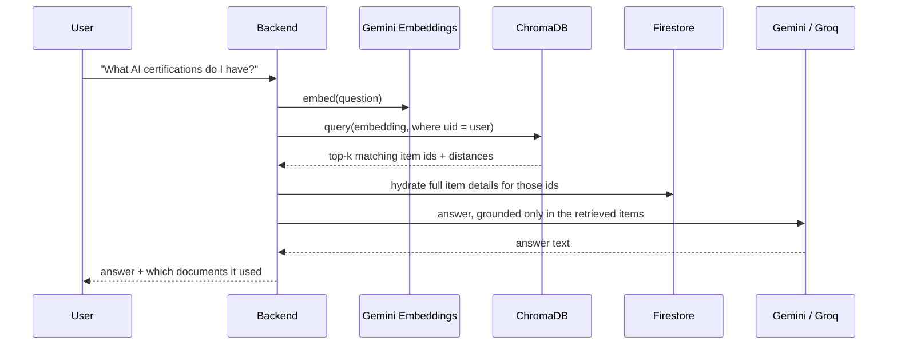

# Architecture — Mosaic AI

## System overview

Every item a user uploads ends up in three places, keyed by the same Firestore
document id: the **original file** in Cloudinary, the **structured record**
(category, title, skills, entities...) in Firestore, and its **embedding** in
ChromaDB. All three are tagged with `uid`, so one user's documents are never
visible to another's — enforced at the query level, not just the UI.

## Ingestion + categorization (Modules 1 + 2)

The AI provider fallback isn't uniform across file types, because Groq's
text models can't read a PDF or image the way Gemini can. So the pipeline
tries to pull plain text out of the file *first* — that decides which chain
it gets:

Gemini calls use `response_schema` (a Pydantic model) so the model is forced
into the exact shape the app expects — category is validated against the
6 fixed values server-side regardless of what the model returns.

## Search + Chat / RAG (Module 5)

Chat and plain search share the same retrieval step — chat just adds a
generation call on top, and always reports which source items it drew from,
so an answer is checkable against the original document.

## Data model (Firestore `items` collection)

| field | type | notes |
|---|---|---|
| `uid` | string | owner, from the verified Firebase token |
| `category` | string | one of the 6 fixed categories |
| `title`, `organization`, `date`, `description` | string | AI-extracted |
| `skills`, `tags` | string[] | drives the relationship engine + search |
| `entities` | {type, value}[] | people / orgs / dates / locations |
| `file_url` | string | Cloudinary `secure_url` — permanent, so it's stored once at upload and served as-is (no per-read signing step) |
| `cloudinary_public_id` | string | Cloudinary asset id, used to delete the file when the item is deleted |
| `cloudinary_resource_type` | string | `image` for JPG/PNG/WEBP, `raw` for PDF/DOCX/TXT — needed to target the right asset on delete |
| `created_at` | timestamp | |

Relationships (Module 3) aren't a separate stored graph — two items are
related if `skills` overlap, computed on request. Simpler to reason about
than a maintained edge list, and correct by construction since it's always
derived from the current data.
