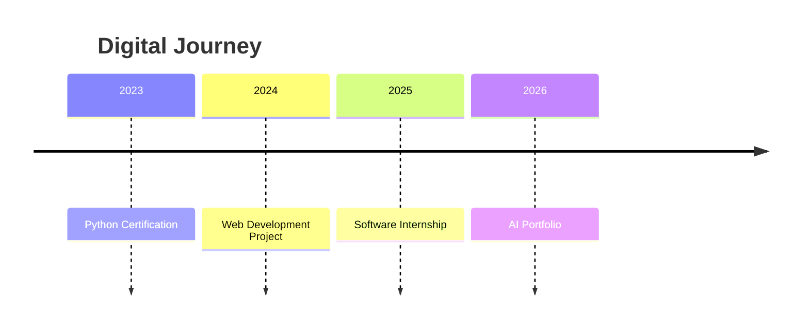
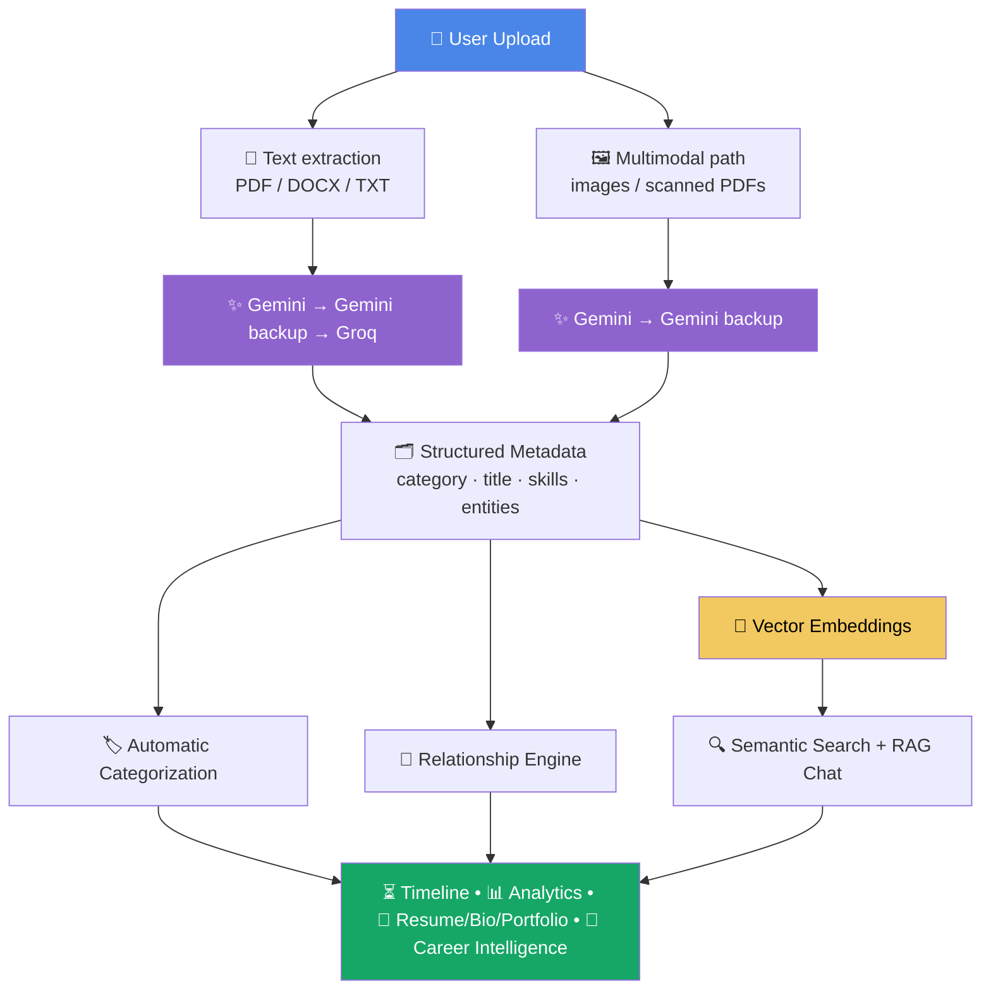
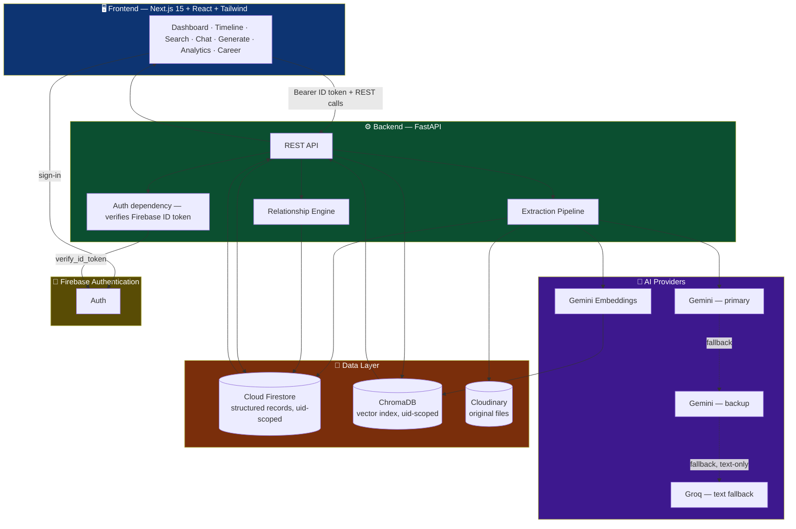

<div align="center">

# 🧩 Mosaic AI

### An AI-powered Digital Identity System that automatically understands, organizes, and connects a student's academic and professional journey.

**Built for MemoryVerse AI '26 · Wooble**

[](https://nextjs.org/)
[](https://fastapi.tiangolo.com/)
[](https://ai.google.dev/)
[](https://firebase.google.com/)
[](https://www.trychroma.com/)
[](https://cloudinary.com/)

</div>

---

## 📖 Problem Statement

Throughout their academic and professional journey, students collect certificates, resumes, internship letters, project reports, achievements, and other important documents.

Over time these files become scattered across folders, cloud storage, emails, and multiple devices. Finding a specific document or understanding how different experiences are connected becomes difficult.

> Traditional storage systems can store files, but they cannot understand a person's journey.

---

## 💡 Solution

**Mosaic AI** transforms scattered documents into an intelligent digital identity.

The system uses AI to extract structured information, automatically categorizes documents, identifies relationships between experiences, builds a digital timeline, and enables natural language search and chat over the user's own data — while every original file stays reachable in its original format.

Every item a user uploads lands in three places, all keyed by the same document id and scoped to that user only: the **original file** in Cloudinary, the **structured record** in Firestore, and its **embedding** in ChromaDB.

---

## ✨ Key Features

### 📄 Module 1 — AI Data Ingestion
- Upload certificates, resumes, internship letters, project reports, and academic documents (PDF, DOCX, TXT, JPG, PNG, WEBP).
- Text-extractable files (PDF-with-text, DOCX, TXT) are read directly; scanned/image documents are sent to **Gemini's multimodal vision** — no separate OCR stage.
- Every upload runs AI extraction and file storage **concurrently**, not sequentially.

### 🏷️ Module 2 — Intelligent Categorization
Every document is automatically classified into exactly one of:

| | | |
|---|---|---|
| Projects | Skills | Certifications |
| Internships | Achievements | Academics |

Category, title, organization, date, a plain-English description, extracted **skills**, **tags**, and named **entities** (people/orgs/dates/locations) are all pulled out in one pass, forced into a fixed JSON shape via schema-constrained generation — a model can never invent a 7th category.

### 🔗 Module 3 — Relationship Engine
Two items are considered related when their extracted **skills overlap** — computed live on request rather than stored as a separate graph, so it's always correct against current data.


### ⏳ Module 4 — Digital Journey Timeline
Every uploaded item, sorted chronologically by its extracted date, into one continuous view of the user's growth.



### 🔍 Module 5 — Smart Retrieval (Semantic Search + RAG Chat)
- **Semantic search** — natural language queries like *"show my AI projects"* or *"show internship documents"*, matched against ChromaDB embeddings, scoped per user.
- **RAG Chat** — ask questions about your own documents; the answer is grounded **only** in the retrieved items and always reports which sources it used, so it's checkable against the original file.

### 🧭 Career Intelligence *(beyond the brief)*
A third AI layer on top of everything the user has uploaded — grounded only in real items, nothing invented:
- **Career Analysis** — readiness score for a target role, strengths, skill gaps (`have` / `partial` / `missing`), and a step-by-step roadmap with named resources.
- **Interview Prep** — 8–10 technical, project, and behavioral questions generated from the user's actual projects and skills, each with an answer hint.
- **Profile Strength** — an overall score plus a 6-axis radar (Projects, Certifications, Internships, Achievements, Skill breadth, Recency) and quick-win suggestions.

### 🪄 AI Content Generation
- **Resume** — grouped into sensible sections with resume-style bullets.
- **Professional Bio** — a warm, first-person summary.
- **Portfolio** — a shareable narrative page with a tagline and themed sections.

All three are generated strictly from what the user has actually uploaded.

### 📊 Analytics Dashboard
Total items, breakdown by category, top skills, and items by year — one glance at the shape of a profile.

---

## 🔄 AI Workflow



**Why the fallback chain branches in two:** Groq's text models can't read a raw PDF or image, so a naive "Gemini → Gemini → Groq" chain would leave Groq silently useless on scanned documents. The pipeline extracts plain text *first* — if it succeeds (PDF-with-text, DOCX, TXT), all three tiers are usable; if it can't (images, scanned/image-only PDFs), the request goes multimodal and stops at Gemini's two keys.

---

## 🏗️ System Architecture



Full sequence diagrams for the upload pipeline and RAG search/chat flow are in [`ARCHITECTURE.md`](ARCHITECTURE.md).

---

## 🛠️ Technology Stack

| Layer | Technology |
|---|---|
| **Frontend** | Next.js 15 (App Router), React, Tailwind CSS |
| **Backend** | FastAPI (Python) |
| **Authentication** | Firebase Authentication |
| **Database** | Cloud Firestore |
| **File Storage** | Cloudinary (originals stay in their native format) |
| **AI Models** | Gemini (primary + backup) → Groq (text fallback) |
| **Embeddings** | Gemini Embeddings, 768-dim |
| **Vector Database** | ChromaDB — embedded, per-user scoped |
| **Deployment** | Vercel (frontend), Render (backend) |

---

## 📂 Project Structure

```
mosaic-ai/
├── app/                    # Next.js App Router
│   ├── dashboard/          # Dashboard, Timeline, Search, Chat, Generate, Analytics, Career, Settings
│   ├── login/ signup/
│   └── page.tsx            # Landing page
├── backend/
│   ├── main.py              # FastAPI entrypoint
│   ├── routes/               # items, search, generate, analytics, career
│   ├── extraction.py         # Document parsing + AI extraction
│   ├── providers.py          # Gemini → Gemini backup → Groq fallback chain
│   ├── embeddings.py          # Gemini embeddings
│   ├── vectorstore.py         # ChromaDB, per-user scoped
│   ├── storage_utils.py        # Cloudinary upload/delete
│   ├── firebase_init.py        # Firebase Admin SDK init
│   └── auth.py                # Firebase ID token verification
├── components/              # Upload dropzone, item cards, relationship graph, etc.
├── lib/                     # api.ts (typed service layer), firebase.ts, auth-context.tsx
├── docs/                    # INSTALL.md, ENV_VARS.md, DEPLOY.md
├── ARCHITECTURE.md           # Full sequence diagrams + data model
├── THOUGHT_PROCESS.md         # Design decisions and trade-offs
└── README.md
```

---

## ⚡ Getting Started

### Frontend

```bash
npm install
npm run dev
```

### Backend

```bash
cd backend
pip install -r requirements.txt
python main.py
```

Copy `.env.example` → `.env` and fill in your own credentials before running locally — see:

- [`docs/INSTALL.md`](docs/INSTALL.md)
- [`docs/ENV_VARS.md`](docs/ENV_VARS.md)
- [`docs/DEPLOY.md`](docs/DEPLOY.md)

---

## 🎬 Demo Flow


1. Sign in to Mosaic AI.
2. Upload academic or professional documents.
3. AI extracts structured information (Gemini/Groq).
4. Documents are automatically categorized into one of 6 fixed categories.
5. Related experiences are connected via shared skills.
6. A digital timeline is generated, sorted by date.
7. Search documents using natural language.
8. Chat with uploaded documents — answers cite their sources.
9. Generate a resume, bio, or portfolio.
10. Get a career readiness score, skill-gap roadmap, and interview prep for a target role.

---

## ⚠️ Current Limitations

- API keys must be configured before running locally (`.env` — see `docs/ENV_VARS.md`).
- Render free tier does not provide persistent storage for ChromaDB — the vector index rebuilds on cold start.
- Relationships are computed from shared skill tags only, not time-ordered causality.
- No OCR fallback if Gemini vision misreads a scanned/handwritten document.

---

## 🚧 Future Improvements

- [ ] OCR as a second opinion on scanned/handwritten certificates
- [ ] Pull structured data directly from a GitHub profile (README, languages, commits)
- [ ] Time-aware relationships ("this internship's skills *led to* that project")
- [ ] Caching for repeated searches/generations
- [ ] Mobile application

---

## 🎯 Project Goal

The goal of Mosaic AI is simple:

> **Upload your documents once and never waste time searching through folders again.**

By combining AI-powered document understanding, semantic search, relationship mapping, timeline generation, and career intelligence, Mosaic AI creates an intelligent digital identity that grows with the user throughout their academic and professional journey.

<div align="center">

---

Made By Harsh Vardhan ❤️ for **MemoryVerse AI '26** · Wooble

</div>
